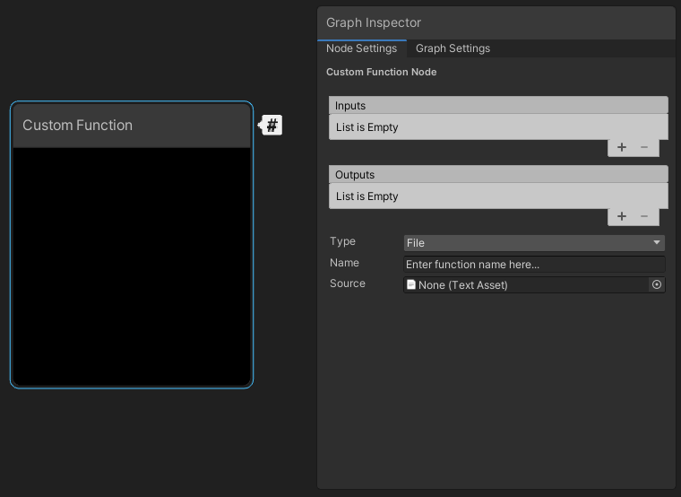

# Custom Function Node

Use the Custom Function Node to inject your own custom HLSL code in Shader Graphs to do some fine-grained optimization, for example.

You can either write small functions directly into graphs by using the string mode, or reference external HLSL files. Use the [Custom Port Menu](Custom-Port-Menu.md) to define your own input and output ports on the node itself.

| Property | Description |
|:----------|:------------|
| **Inputs** | Define the node's input ports. The names you enter here define the names for the input values you use in the code. |
| **Outputs** | Define the node's output ports. The names you enter here define the names for the output values you use in the code. |
| **Type** | Select the way to reference the custom function in the node. The options are:<ul><li>**File**: Reference an external file that contains the functions.</li><li>**String**: Directly write functions in the node.</li></ul> |
| **Name** | The name of the custom function in the code, **without** the function precision suffix `_half ` or `_float `. |
| **Source** | When you set **Type** to **File**, the reference to the HLSL file that includes the custom functions. The file can be anywhere in your Unity project and must have the `.hlsl` extension. For more details, refer to [file content syntax](#file-content-syntax-details-and-examples). |
| **Body** | When you set **Type** to **String**, the HLSL code that defines the contents of the custom functions. Unity handles the arguments, braces, and indent scope automatically. |

## Additional resources

- [Create a Custom Function node](Custom-nodes-hlsl-create-custom-function-node.md)
